# Mission 1 : Mise en place du serveur Windows Server 2019

**Compte rendu rédigé par** : BIDANESSY Coumba  
**Formation** : BTS SIO 1ère année - Option SISR  
**Établissement** : Lycée Paul-Louis Courier, Tours  

---

## Maquette Packet Tracer et implémentation du protocole DNS

Voici la maquette Packet Tracer avec l'implémentation du DNS

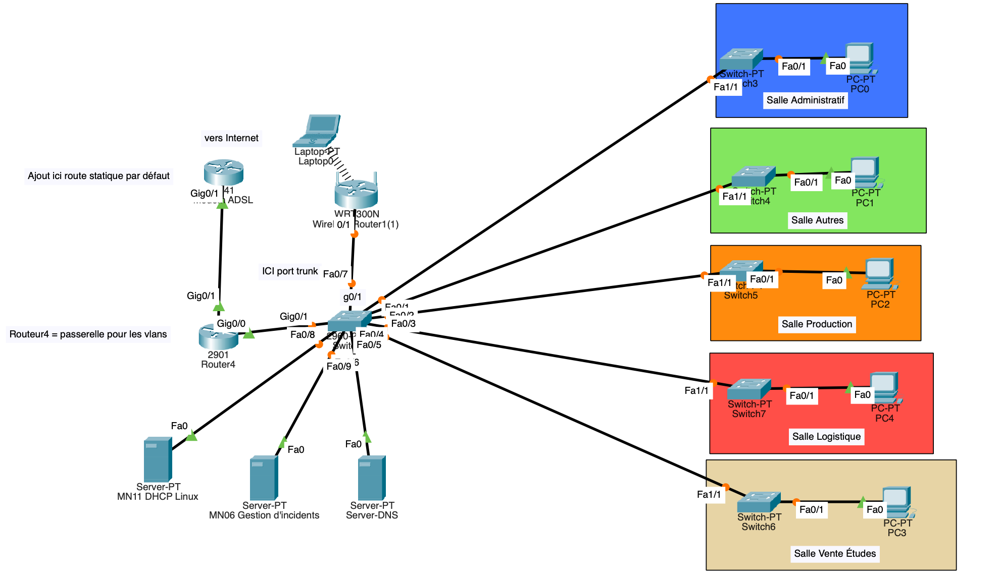

---

## Implémentation de l'Active Directory

### Procédure d'installation d'Active Directory dans le gestionnaire de serveur

> Suivi des indications pour l'installation d'Active Directory

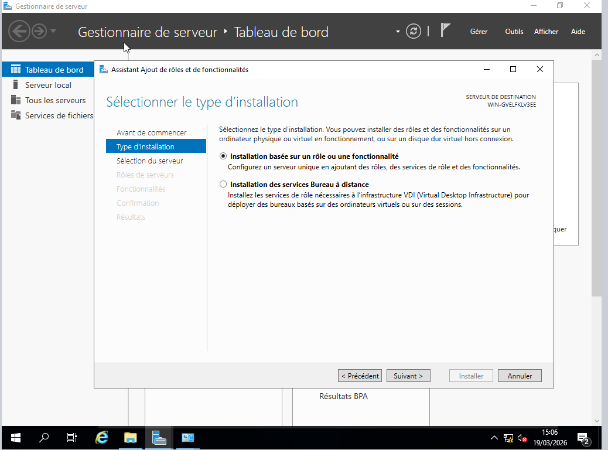
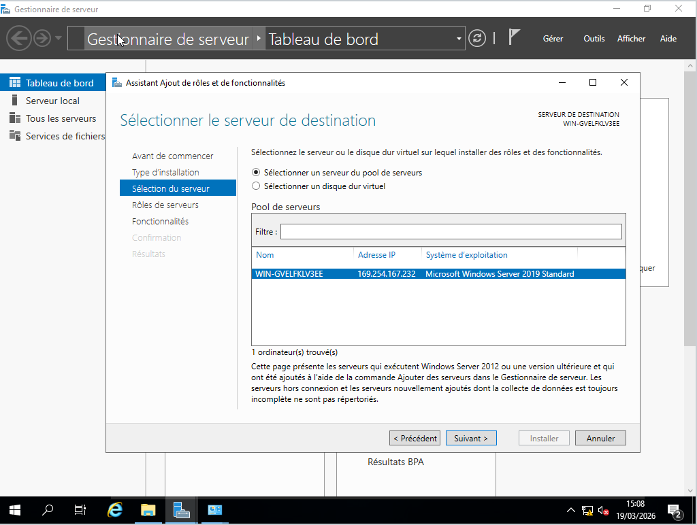  
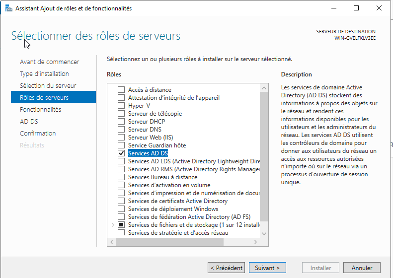  
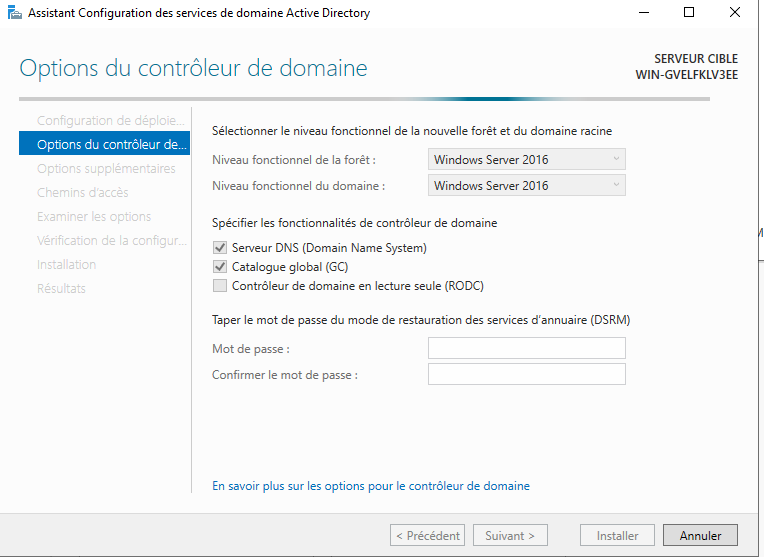  
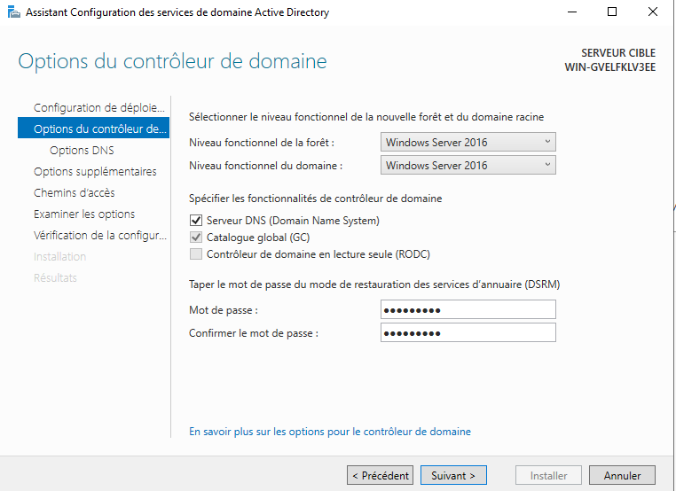  
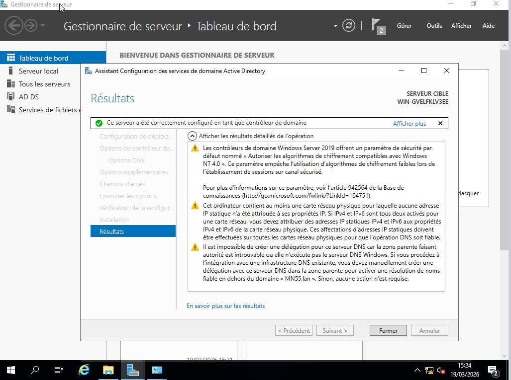

---

### Mise en place d'une unité d'organisation

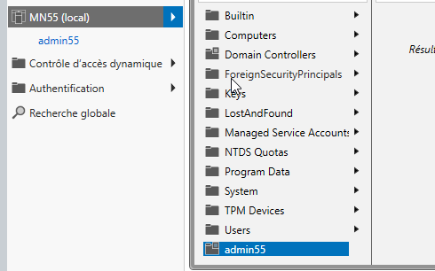

---

### Création d'utilisateurs dans l'unité d'organisation

> Création du compte julie  

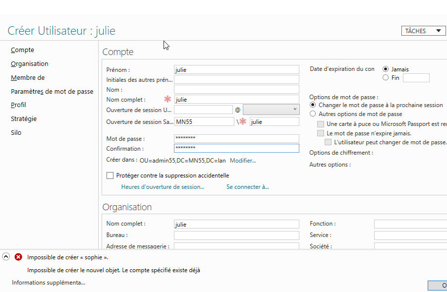

> Résultat final des utilisateurs dans l'unité d'organisation "admin55"  

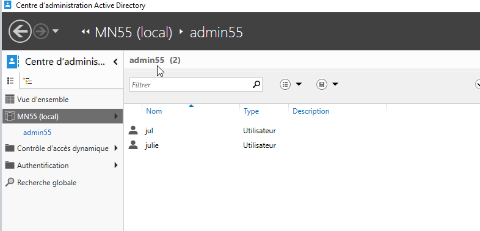

---

### Création d'un groupe d'utilisateurs dans le service RH

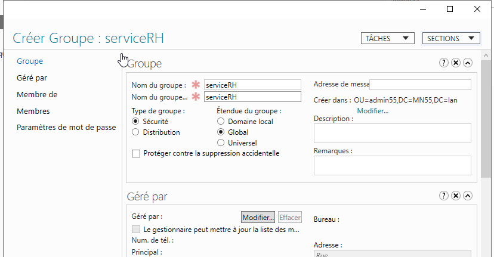

> Permissions accordées au groupe RH  

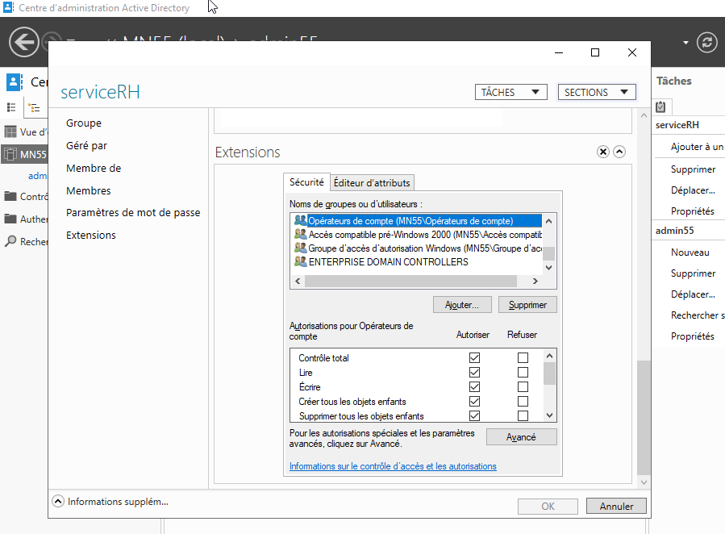

---

## Implémentation du serveur DNS

> Accès au gestionnaire DNS → Zone de recherche directes → lien de l'adresse IP du serveur DNS 172.16.55.250/24 au nom de domaine MN55.lan  

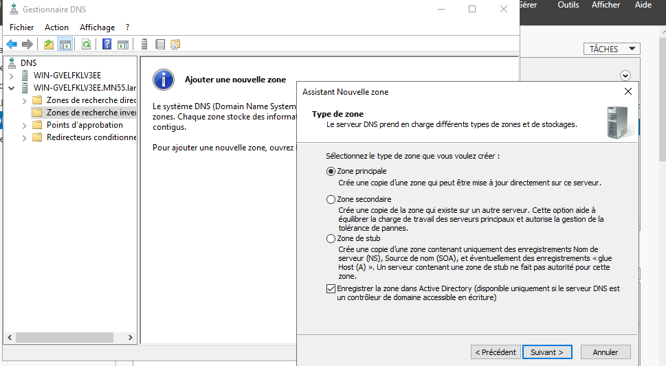

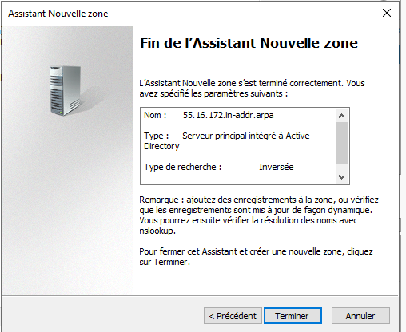

---

# Implémentation d'un client dans le même domaine Active Directory que le serveur Windows

### Configuration en DHCP du PC intégré dans le VLAN 20

> ipconfig /all
---

---

## Fiche de tests

### Utilisateur sur le logiciel VirtualBox qui accède à l'unité d'organisation créée sur Nutanix

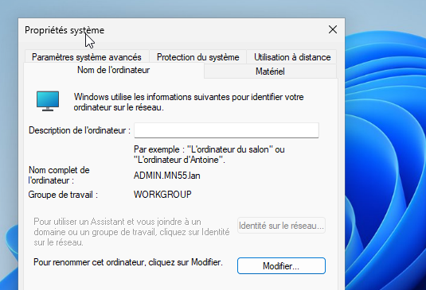

---

## Accès par l'utilisateur du nom de domaine MN55.lan

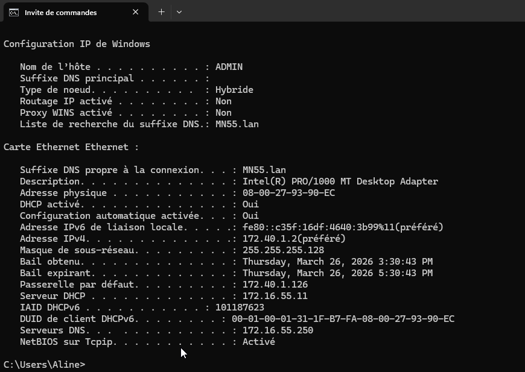
